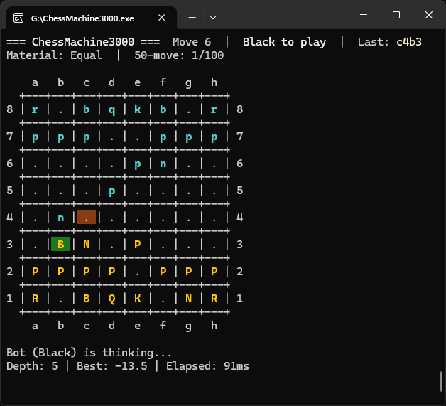
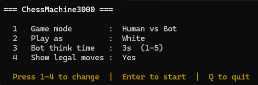

# ChessMachine3000

A terminal-based chess engine written in C++. Play against the bot or watch two bots play each other.



> *Bot vs Bot, 1 second think time*

## Features

- Human vs Bot and Bot vs Bot modes
- Colored board with last-move highlighting
- Configurable bot think time (1–5 seconds)
- Iterative deepening minimax with alpha-beta pruning and parallel root search
- Move ordering for better pruning efficiency
- Full chess rules: castling, en passant, pawn promotion, 50-move rule, threefold repetition
- Material balance and check indicator in the UI

## Documentation

Full API documentation is available at **[ilkkahirvela.github.io/ChessMachine3000](https://ilkkahirvela.github.io/ChessMachine3000/)**.

## Download

A pre-built Windows executable is available on the [Releases](https://github.com/ilkkahirvela/ChessMachine3000/releases/latest) page — no installation or build tools required. Download `ChessMachine3000.exe` and run it directly.

## Building from source

**Requirements:** Windows, Visual Studio 2022

### Visual Studio
Open `ChessMachine3000.sln`, set the configuration to **Release** and platform to **x64** in the toolbar, then press **Ctrl+Shift+B**.

### Command line
```
MSBuild ChessMachine3000.sln /p:Configuration=Release /p:Platform=x64
x64\Release\ChessMachine3000.exe
```

### Visual Studio Code
1. Install the [C/C++ extension](https://marketplace.visualstudio.com/items?itemName=ms-vscode.cpptools)
2. Create `.vscode/tasks.json`:
```json
{
    "version": "2.0.0",
    "tasks": [
        {
            "label": "Build Release",
            "type": "shell",
            "command": "C:\\Program Files\\Microsoft Visual Studio\\2022\\<Edition>\\MSBuild\\Current\\Bin\\MSBuild.exe",
            "args": [ "ChessMachine3000.sln", "/p:Configuration=Release", "/p:Platform=x64" ],
            "group": { "kind": "build", "isDefault": true },
            "problemMatcher": "$msCompile"
        }
    ]
}
```
3. Create `.vscode/launch.json`:
```json
{
    "version": "0.2.0",
    "configurations": [
        {
            "name": "Run",
            "type": "cppvsdbg",
            "request": "launch",
            "program": "${workspaceFolder}/x64/Release/ChessMachine3000.exe",
            "console": "integratedTerminal",
            "preLaunchTask": "Build Release"
        }
    ]
}
```
4. Press **F5** to build and run.

## How to Play

### Settings menu



At startup you will see a settings menu. Press keys to change options.

| Key | Setting |
|-----|---------|
| `1` | Toggle game mode (Human vs Bot / Bot vs Bot) |
| `2` | Toggle your color (White / Black) |
| `3` | Cycle bot think time (1s → 2s → 3s → 4s → 5s) |
| `4` | Toggle legal moves display |
| Enter | Start game |
| `Q` | Quit |

### Move input
Moves are entered in **UCI format**: from-square followed by to-square.

```
e2e4    move pawn from e2 to e4
g1f3    move knight from g1 to f3
e7e8q   pawn promotion to queen
```

### In-game commands

| Command | Action |
|---------|--------|
| `undo`  | Revert the last two moves (your move + bot's response) |
| `quit`  | Return to the settings menu |

## Engine

The bot uses **iterative deepening minimax** with **alpha-beta pruning**. At each depth it searches legal moves in parallel at the root, with move ordering (captures and promotions first) to improve pruning in the sequential search below.

## License

MIT, see [LICENSE](LICENSE)
